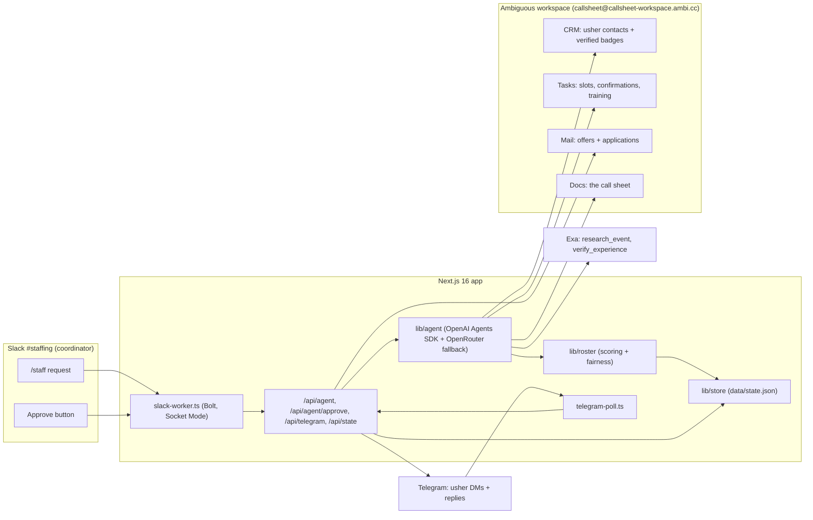

# Callsheet

An AI staffing coordinator that lives inside the crew channel event agencies already run, and keeps its own office (inbox, CRM, tasks, call sheet) in Ambiguous, so 60 ushers get placed on verified experience in minutes instead of by wasta over weeks.

Built for AI Tinkerers "Agents, Everywhere".

## Why this could not be a chatbox

- The environment is the point: agencies already run staffing through Liveforce or WhatsApp broadcasts staff cannot reply to. Callsheet turns that same channel two-way, for everyone in it at once.
- A 1:1 chatbox handles one conversation. Callsheet handles 60 offers, 60 replies, a live waitlist and a fill meter, concurrently, in the channel the crew is already in.
- The agent keeps its own paperwork. Applications, verified event history, open tasks and the call sheet live in Ambiguous under the agent's own identity, not in a prompt window that forgets them on close.
- Fairness is enforced in code, not promised in a reply: 10 percent of every area's slots are reserved for first-timers, every run.
- The anti-wasta mechanism is structural: Exa checks a claimed event actually happened before a badge is granted, so placement runs on verified history rather than who called whom.
- Nothing sends without a human tap. The approval boundary is one API call, gated on a Slack button, not a suggestion the agent can talk itself past.

## How it works

1. **Request in Slack.** The coordinator posts a plain-English staffing request in `#staffing` (or runs `/staff`): dates, areas, headcount, rate, training.
2. **Exa research.** `research_event` resolves venue, dates and organiser, and flags mismatches in the brief (for example "ADNOC Centre" corrected to ADNEC).
3. **CRM search + verification.** `search_crew` finds candidates in Ambiguous CRM by skill, city and availability; `verify_experience` checks each claimed past event against Exa before granting a verified badge.
4. **Fair roster.** `build_roster` scores and allocates candidates, reserves 10 percent of every area for first-timers, and sets a waitlist.
5. **Approve in Slack.** The coordinator reviews the roster and taps Approve. Nothing is sent before this. This is the only human gate in the loop.
6. **Telegram / email offers.** `send_offers` DMs each usher on Telegram with dates, hours, rate, training, transport, meals and position; agencies that use email get an Ambiguous mail instead. Each send carries an idempotency key; a task is created per pending confirmation.
7. **Replies.** Ushers reply "yes" or "no" in Telegram; "yes" confirms and assigns, "no" promotes the next name off the waitlist, questions are answered from the brief.
8. **Call sheet in Ambiguous.** `write_callsheet` keeps a live document in Ambiguous updated as replies land, with a training-reminder task per confirmed usher.

## Architecture



## Sponsor map

| Sponsor | What it does here |
|---|---|
| **Ambiguous** | The agent's own office: CRM holds ushers as contacts with verified-event badges, Tasks track open slots, pending confirmations and training reminders, Mail sends offers from the agent's own address with idempotency keys and contact linking, and a Doc is the live call sheet. System of record for the whole run. |
| **Exa** | `research_event` resolves venue, dates and organiser from the coordinator's plain-English request and corrects mistakes in it; `verify_experience` checks that an usher's claimed past events actually happened. |
| **OpenAI Agents SDK (TypeScript)** | Runs the tool-calling loop itself: `research_event`, `search_crew`, `verify_experience`, `build_roster`, `send_offers`, `record_reply`, `write_callsheet`. |
| **OpenRouter** | Fallback model routing in Chat Completions mode if the primary OpenAI key or model is unavailable, so one provider outage does not stop the run. |
| **Slack (Bolt, Socket Mode)** | The coordinator's environment: the `/staff` command, the approval button, and the live event log thread, including tool failures. |
| **Telegram (Bot API)** | The usher's environment: the offer DM and the "yes/no" reply that drives confirmation and waitlist promotion. |

## Run locally

```bash
pnpm install
cp .env.example .env.local
# fill in .env.local: EXA_API_KEY, OPENAI_API_KEY or OPENROUTER_API_KEY,
# TELEGRAM_BOT_TOKEN, SLACK_BOT_TOKEN/SLACK_APP_TOKEN/SLACK_SIGNING_SECRET/SLACK_CHANNEL_ID

npx ambiguous@latest auth signup --name "Callsheet" --workspace-name "Callsheet Crew" --human-email novalabshq@gmail.com
# key lands in ./.ambi/config.json

pnpm exec tsx --env-file=.env.local scripts/seed-ambiguous.ts   # loads data/seed.json into CRM
pnpm dev                                                        # coordinator console, localhost:3000
pnpm exec tsx --env-file=.env.local scripts/slack-worker.ts     # Bolt Socket Mode worker
pnpm exec tsx --env-file=.env.local scripts/telegram-poll.ts    # Telegram getUpdates poll
```

## Status

**Real today:** Slack request in, Exa venue research and correction, CRM search against seeded ushers, verified-event badging, fair roster build with a 10 percent first-timer reservation and waitlist, Slack approval gate, Telegram offers and replies, call sheet and tasks in Ambiguous, timeouts and error surfacing on every external call.

**Roadmap:** voice confirmation calls to ushers, direct Liveforce API sync in place of seed data, a WhatsApp channel (a teammate's n8n instance could bridge this once a bot credential is handed over).

**Not used:** Auth0 and CopilotKit Channels were scoped and deliberately cut for time; said so honestly rather than claiming them.

## Team

Amir Hossein Kazemkhani: build.
Omar Tageldin: usher; the demo persona is his real staffing history (Mubadala World Tennis Championship, Etihad Airways activation, ADNOC events), verified on camera rather than staged.
