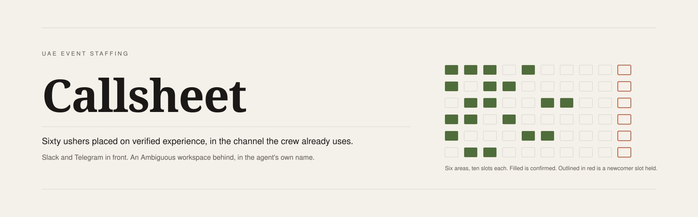
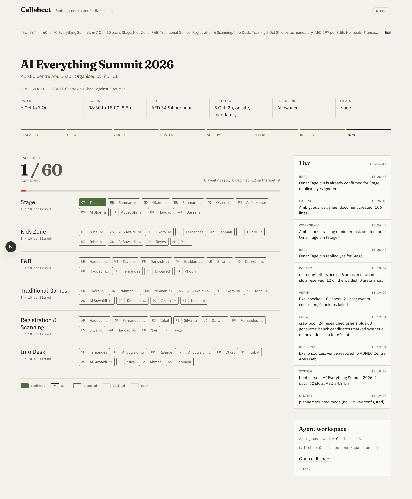
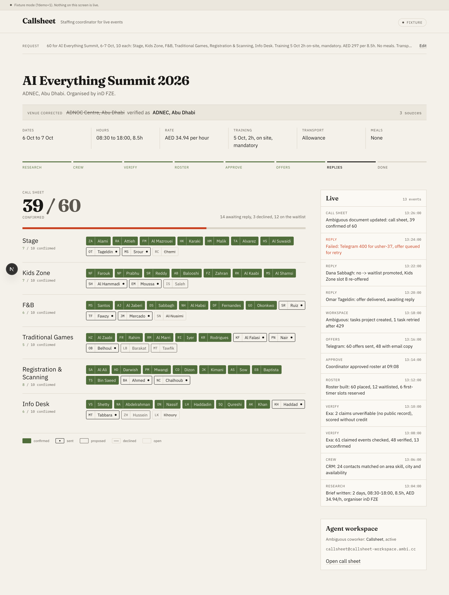
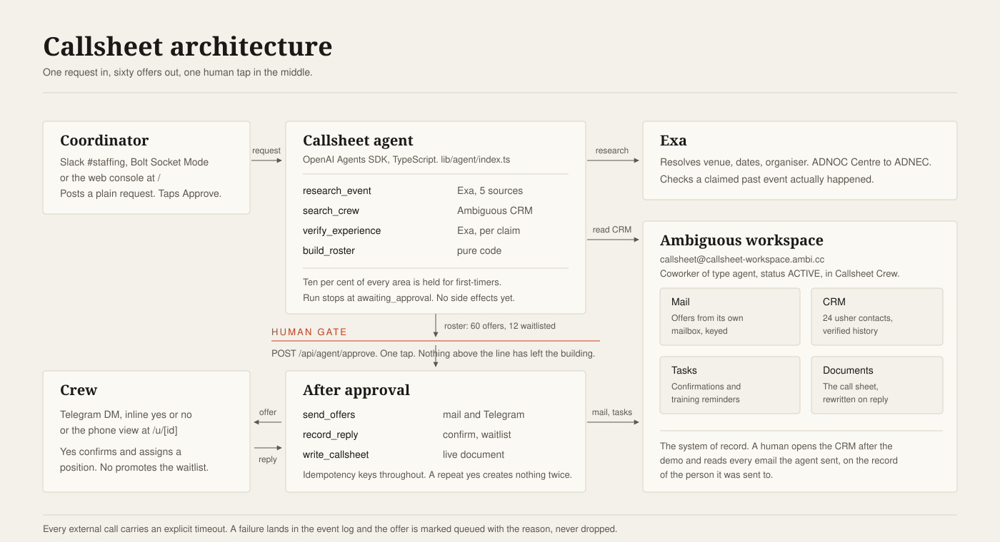

<p align="center">
  
</p>

# Callsheet

An AI staffing coordinator that takes a plain request in Slack, places sixty ushers on verified experience, and keeps its own inbox, CRM, tasks and call sheet in an [Ambiguous](https://www.ambiguous.ai/) workspace under its own name.

## The problem in 20 seconds

Omar Tageldin works as an usher in Dubai. He is on this team.

He keeps four agency profiles open at once: THA By Armonia, Event Lab UAE, GIGZ PLUS, Talent BluePrint.
He waited a month for an interview on one of them.
He has never been placed through the app. Every job he has worked came through someone he knows.
The agency app he uses, Liveforce, has a job chat that is one way: staff read the post, staff cannot reply.

Two numbers, both sourced in [docs/research/industry.md](docs/research/industry.md):

- Ushers in Dubai are paid AED 50 to 200 per hour, and agencies book them by the hundred.
- One agency deployed 500 or more event professionals for a single Formula 1 weekend, inside three weeks.

That volume is run today on broadcast posts, WhatsApp groups and wasta. Nobody is reading 500 replies fairly.

## What Callsheet does

1. The coordinator posts a plain request in Slack or the console: sixty ushers, two days, six areas, rate, training.
2. `research_event` asks Exa what the event actually is, and corrects the brief: "ADNOC Centre" resolves to ADNEC Centre Abu Dhabi, with five sources.
3. `search_crew` pulls candidates out of the agent's own Ambiguous CRM by skill, city and availability.
4. `verify_experience` checks each claimed past event against the web, so a badge means a record, not a claim.
5. `build_roster` scores and allocates in pure code, holds ten per cent of every area's slots for first-timers, and fills a waitlist.
6. The run stops. A human reads the roster and taps Approve. Nothing has left the building yet.
7. `send_offers` mails each usher from the agent's own Ambiguous mailbox, with an idempotency key and the contact id, and DMs the ones on Telegram with inline yes and no buttons.
8. `record_reply` confirms a yes, promotes the waitlist on a no, and opens a training reminder task for anyone now on the crew.
9. `write_callsheet` writes the call sheet into Ambiguous as a live document and rewrites it as replies land.

## Why it could not be a chatbox

- It is a one to many allocation problem: sixty offers, sixty replies, one waitlist, one fill meter, all moving at once.
- The group is the interface. Staffing already happens inside a channel, so the agent belongs in the channel rather than in a private window.
- The agent has its own seat and its own inbox. It is a registered coworker in the workspace, so the paperwork survives the conversation.
- There is one approval gate, and it is an API boundary rather than a prompt instruction. An agent cannot talk itself past `POST /api/agent/approve`.
- The paperwork writes itself into normal apps. A human opens the CRM, the task board or the document and reads what happened, with no access to this repository.

## A real run

The event log below is the output of one run on build day, trimmed only of HTTP access lines.

```
[WARN ] system: planner: scripted mode (no LLM key configured)
[info ] system: brief parsed: AI Everything Summit 2026, 2 days, 60 slots, AED 34.94/h
[info ] research_event: Exa: 5 sources, venue resolved to ADNEC Centre Abu Dhabi
[WARN ] search_crew: crew pool: 24 researched ushers plus 60 generated bench candidates (marked synthetic, demo addresses) for 60 slots
[info ] verify_experience: Exa: checked 10 ushers, 21 past events confirmed, 0 lookups failed
[info ] build_roster: roster: 60 offers across 6 areas, 6 newcomer slots reserved, 12 on the waitlist, 0 areas short
[info ] approve_roster: coordinator approved 60 offers, human gate passed
[info ] sync_workspace: Ambiguous: project 115c3118-07c9-46ab-b278-bafc79bfd9ff ready (callsheet-workspace)
[WARN ] send_offers: offers: 6 sent, 54 queued with an error, 6 real emails via Ambiguous (delivered to the agent mailbox, set OFFER_MAIL_TO to reach the crew)
[info ] sync_workspace: Ambiguous: 6 confirmation tasks created under project 115c3118-07c9-46ab-b278-bafc79bfd9ff
[info ] record_reply: Omar Tageldin replied yes for Stage
[info ] sync_workspace: Ambiguous: training reminder task c44469bc-deeb-45ac-999c-4db8ead15bd9 created
[info ] write_callsheet: Ambiguous: call sheet document created at https://app.ambiguous.ai/callsheet-workspace/documents/ed8b529e-26f7-4bcc-aae9-26fd9a1edea2
[info ] record_reply: Omar Tageldin is already confirmed for Stage, duplicate yes ignored
```

Read the warnings, they are the interesting part. Fifty-four offers were queued rather than sent, because bench candidates carry undeliverable demo addresses and real mail is capped at `OFFER_MAIL_LIMIT=6` for a demo run. Each queued offer carries its reason. The last line is the idempotency guarantee doing its job: a second yes from the same usher created no second task.

## The two screens

Real state from the run above. The venue is shown corrected and verified against five sources, the stepper has reached DONE, one usher has confirmed, and the event log carries the duplicate reply being ignored. The workspace card names the agent's own mailbox.



The same console in fixture mode, which the page labels on screen as fixture data. It shows what a full reply cycle looks like: 39 of 60 confirmed, a decline promoting the waitlist in the same second, a Telegram send that failed and was queued for retry rather than dropped, and a 429 from Ambiguous retried once.



## How Ambiguous is used

Ambiguous is not a logging sink here. It is where the agent lives: a coworker of type `agent`, status `ACTIVE`, in the workspace "Callsheet Crew", with its own mailbox `callsheet@callsheet-workspace.ambi.cc`. Every call is REST with `Authorization: Bearer` and `API-Version: 1`.

| Primitive | What we do with it | Where in code |
|---|---|---|
| Coworker identity | The agent owns a mailbox and sends as itself, not as a service account. Offers arrive from a named colleague. | [`agentEmail()`, `lib/integrations/ambiguous.ts:46`](lib/integrations/ambiguous.ts) |
| CRM contacts | 24 ushers as contacts with custom properties: skills, languages, rating, reliability, verified events, Telegram chat id. `search_crew` reads this, not a local file. | [`upsertContact()`, `lib/integrations/ambiguous.ts:199`](lib/integrations/ambiguous.ts) |
| Projects | One staffing project per event, so tasks are visible to the workspace instead of private to the creator. | [`ensureProject()`, `lib/integrations/ambiguous.ts:158`](lib/integrations/ambiguous.ts) |
| Tasks | One confirmation task per offer sent, one training reminder per usher confirmed. The response body is checked for `project_id` and rejected without it. | [`createTask()`, `lib/integrations/ambiguous.ts:253`](lib/integrations/ambiguous.ts) |
| Mail | The offer itself, sent from the agent's mailbox with an `Idempotency-Key` and a `contact_id` so it is logged on the usher's CRM record. A 409 on a reused key is treated as already sent. | [`sendMail()`, `lib/integrations/ambiguous.ts:292`](lib/integrations/ambiguous.ts) |
| Documents | The call sheet, created on the first confirmation and rewritten in place on every reply. | [`createDoc()` and `updateDoc()`, `lib/integrations/ambiguous.ts:334`](lib/integrations/ambiguous.ts) |
| Rate limits | 429 honoured through `Retry-After`, once, then surfaced. | [`request()`, `lib/integrations/ambiguous.ts:77`](lib/integrations/ambiguous.ts) |

The deep dive, including the exact request shapes and why idempotency keys matter on stage, is in [docs/AMBIGUOUS.md](docs/AMBIGUOUS.md).

## Judging criteria

| Criterion | What we built | Evidence |
|---|---|---|
| Core requirements and functionality | The full loop runs end to end: request, research, search, verify, roster, approval, offers, replies, call sheet. | The run log above. 45 unit tests in `lib/`. |
| Innovation and theme alignment | The agent works inside the environment the industry already uses, and holds its own seat in a workspace rather than a chat window. Fairness is enforced in code, not promised in prose. | `buildRoster()` in [lib/roster/build.ts](lib/roster/build.ts), test "reserves 10 percent of each area for newcomers, rounded up". |
| Technical execution and integration | Explicit timeouts on every external call, idempotency keys on mail and tasks, 429 and 409 handled, failures surfaced as state rather than swallowed. | [lib/integrations/ambiguous.test.ts](lib/integrations/ambiguous.test.ts), [lib/integrations/telegram.test.ts](lib/integrations/telegram.test.ts). |
| Usefulness and agentic experience | One human tap sits between a proposal and sixty messages. Everything else is readable by a non-technical coordinator in normal apps. | [`approveAndSend()`, lib/agent/index.ts:371](lib/agent/index.ts), [app/api/agent/approve/route.ts](app/api/agent/approve/route.ts). |

The criterion by criterion write-up, with the gaps stated, is in [docs/JUDGING.md](docs/JUDGING.md).

## Architecture

<p align="center">
  
</p>

Longer version, including the failure table, in [docs/ARCHITECTURE.md](docs/ARCHITECTURE.md).

## Run it in five minutes

```bash
pnpm install
cp .env.example .env.local
# EXA_API_KEY is the only key needed for the research path.
# OPENAI_API_KEY or OPENROUTER_API_KEY switches the planner from scripted to LLM.
# TELEGRAM_BOT_TOKEN and the four SLACK_* values are optional.

npx ambiguous@latest auth signup --name "Callsheet" \
  --workspace-name "Callsheet Crew" --human-email you@example.com
# the key lands in ./.ambi/config.json

pnpm exec tsx --env-file=.env.local scripts/seed-ambiguous.ts   # 24 ushers into the CRM
pnpm dev                                                        # console on localhost:3000
```

Then paste a request into the console, watch the event log, and tap Approve. Optional workers: `scripts/slack-worker.ts` for the Slack side, `scripts/telegram-poll.ts` for replies.

```bash
pnpm exec vitest run      # 45 tests
pnpm exec tsc --noEmit
pnpm lint
```

## What is real today

| Claim | State | How to check |
|---|---|---|
| Exa research and venue correction | Live, ran against the real API | Run log: "5 sources, venue resolved to ADNEC Centre Abu Dhabi" |
| Experience verification | Live: 21 claimed events confirmed across 10 ushers | Run log line for `verify_experience` |
| Ambiguous CRM, tasks, mail, document | Live from the agent's own mailbox | The workspace, and the document URL in the run log |
| Fairness and waitlist | Live and unit tested | 6 newcomer slots and 12 waitlisted in the run log, [lib/roster/build.test.ts](lib/roster/build.test.ts) |
| Approval gate | Live, one API boundary | [app/api/agent/approve/route.ts](app/api/agent/approve/route.ts) |
| LLM planner | Implemented, not exercised | No model key on build day, so every run used the scripted planner. The log says so on line one. |
| Telegram and Slack workers | Implemented and unit tested, not run live | No bot tokens on build day. [lib/integrations/telegram.test.ts](lib/integrations/telegram.test.ts), [lib/slack/blocks.test.ts](lib/slack/blocks.test.ts) |
| The 60 person crew | 24 researched ushers, the rest generated bench | The pool is labelled synthetic in the log and given undeliverable addresses on purpose |

## Next

- Wake on new mail through the Ambiguous notifications watch, so an usher can apply by emailing the agent and become a CRM contact without anyone running a command.
- An Ambiguous Form as the public applicant intake, so a first-timer applies once instead of to four agencies.
- Ambiguous Automations for the parts that do not need a model: chasing an unread offer, closing a confirmation task on reply.
- The Liveforce GraphQL API in place of seed data, so the CRM is the agency's real bench.

## Team

Amir Hossein Kazemkhani, Omar Tageldin, and team.

Omar is a working usher in Dubai. The demo persona is his own staffing history, not a fixture.
